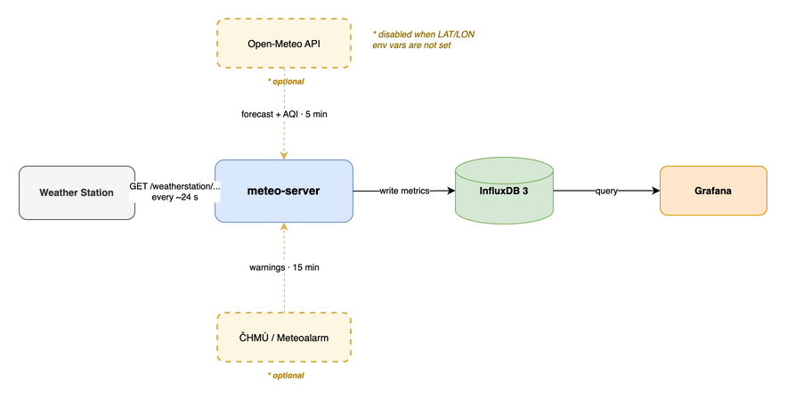

# meteo-server

A minimal FastAPI server that receives data from a personal weather station. It implements a Wunderground-compatible endpoint: the station sends readings as a GET request, the server authenticates credentials, computes derived values, and writes them to InfluxDB 3.

## Architecture



The station sends a reading every ~24 seconds. meteo-server authenticates it, derives additional values (unit conversions, feels-like temperature, wet-bulb, cloud base, sensor anomaly flags), and writes everything to InfluxDB. Grafana reads from InfluxDB for dashboards.

The two dashed sources are optional enrichments pulled in the background:

- **Open-Meteo API** (every 5 min) — current forecast temperature and wind, used to compare how well the forecast matched the station reading; also provides AQI, PM2.5, and PM10. Enabling it also unlocks the clear-sky solar radiation model.
- **ČHMÚ / Meteoalarm** (every 15 min) — active weather warning levels for Czechia, fed into the composite `meteo_weather_score`.

Both are disabled when `LAT`/`LON` are not set. The server works fully offline with no outbound connections; the external fields simply won't appear in InfluxDB.

## Running locally

```bash
python -m venv .venv
source .venv/bin/activate
pip install -r requirements.txt
STATION_ID=myid STATION_PASSWORD=mypass INFLUXDB_TOKEN=mytoken python main.py
```

The server listens on port `8080` (override with `PORT`). Log level is controlled by `LOG_LEVEL` (default `INFO`).
Outside Docker the server runs without TLS unless the files referenced by `SSL_KEY` and `SSL_CERT` exist.

InfluxDB configuration:

| Variable | Default | Description |
| --- | --- | --- |
| `INFLUXDB_URL` | `http://meteo-db:8181` | InfluxDB 3 Core URL |
| `INFLUXDB_DATABASE` | `meteo` | Target database |
| `INFLUXDB_TOKEN` | none | Bearer token for writes; for InfluxDB 3 Core it should start with `apiv3_` |
| `INFLUXDB_TIMEOUT` | `15` | HTTP write timeout in seconds |
| `INFLUXDB_DISABLED` | none | Set to `1`, `true`, or `yes` to skip InfluxDB writes |

External data sources:

| Variable | Default | Description |
| --- | --- | --- |
| `LAT` / `LON` | none | Station coordinates; without these the Open-Meteo fetcher and clear-sky model are disabled |
| `OPEN_METEO_FORECAST_URL` | `https://api.open-meteo.com/v1/forecast` | Open-Meteo forecast endpoint |
| `OPEN_METEO_AIR_QUALITY_URL` | `https://air-quality-api.open-meteo.com/v1/air-quality` | Open-Meteo air quality endpoint |
| `CHMI_WARNINGS_URL` | `https://feeds.meteoalarm.org/feeds/meteoalarm-legacy-atom-czechia` | Meteoalarm Atom feed with ČHMÚ warnings for Czechia |

Other options:

| Variable | Default | Description |
| --- | --- | --- |
| `ENABLE_DOCS` | none | Set to `1`, `true`, or `yes` to enable `/docs`, `/redoc`, and `/openapi.json` |
| `SSL_KEY` | `/app/key.pem` | Path to TLS private key |
| `SSL_CERT` | `/app/cert.pem` | Path to TLS certificate |

## Docker

```bash
docker build -t meteo-server .
docker run -e STATION_ID=myid -e STATION_PASSWORD=mypass -e INFLUXDB_TOKEN=mytoken -p 8080:8080 meteo-server
```

The Docker image generates a self-signed TLS certificate at `/app/key.pem` and `/app/cert.pem` at build time, so the container serves HTTPS on port `8080`. To run plain HTTP in the container, set `SSL_KEY`/`SSL_CERT` to non-existent paths.

In production, InfluxDB is defined in `templates/compose.yaml` as the `meteo-db` service. Compose reads variables from the `.env` file next to `compose.yaml`; for manual deployments use `templates/.env.example` as the starting point.

The playbook writes `.env` from `templates/.env.j2` and writes the offline admin token JSON from `INFLUXDB_ADMIN_TOKEN`. InfluxDB reads that token through `INFLUXDB3_ADMIN_TOKEN_FILE`. The app writes line protocol to `/api/v3/write_lp` in the database set by `INFLUXDB_DATABASE`.

## Development and testing

Install test dependencies alongside the main requirements:

```bash
pip install -r requirements-test.txt
```

Fast test run with no external services:

```bash
pytest -q tests/test_main.py
```

The E2E test starts InfluxDB via Docker/Testcontainers and is gated by an env var:

```bash
RUN_E2E=1 pytest -q tests/test_e2e_influx.py
```

New changes to payload parsing, authentication, log redaction, derived metrics, or line protocol should have a corresponding pytest test. Add an E2E test primarily for changes that directly affect what gets written to InfluxDB.

## Station payload

The station sends data every ~24 seconds as GET parameters to `/weatherstation/updateweatherstation.php`. All values are strings.

| Parameter | Description | Example |
| --- | --- | --- |
| `ID` | Station identifier | `myid` |
| `PASSWORD` | Station password | `mypass` |
| `dateutc` | UTC timestamp (always `now` in realtime mode) | `now` |
| `tempf` | Outdoor temperature (°F) | `71.7` |
| `dewptf` | Dew point (°F) | `53.2` |
| `humidity` | Outdoor relative humidity (%) | `52` |
| `baromin` | Atmospheric pressure (inHg) | `29.90` |
| `windspeedmph` | Average wind speed (mph) | `4.2` |
| `windgustmph` | Wind gust (mph) | `4.6` |
| `winddir` | Wind direction in degrees (0/360 = north, 90 = east) | `312` |
| `rainin` | Rainfall in the last 60 minutes (inches) | `0.0` |
| `dailyrainin` | Rainfall since midnight (inches) | `0.0` |
| `solarradiation` | Solar radiation (W/m²) | `772.55` |
| `UV` | UV index | `5.9` |
| `indoortempf` | Indoor temperature (°F) | `74.8` |
| `indoorhumidity` | Indoor relative humidity (%) | `46` |
| `softwaretype` | Station firmware identifier | `vws versionxx` |
| `action` | Request type (always `updateraw`) | `updateraw` |
| `realtime` | Realtime mode flag (always `1`) | `1` |
| `rtfreq2.5` | Firmware bug: the station sends this key with an empty value instead of `rtfreq=2.5` | `` |

The complete JSON Schema is in [docs/station-payload.schema.json](docs/station-payload.schema.json).

## InfluxDB metrics

Each successful station update writes two groups of points to InfluxDB.

**Measurement `meteo`** (tags: `source=station`, `station_id`):

| Field | Description |
| --- | --- |
| `meteo_temperature_celsius` | Outdoor temperature (°C) |
| `meteo_dew_point_celsius` | Dew point (°C) |
| `meteo_indoor_temperature_celsius` | Indoor temperature (°C) |
| `meteo_humidity_percent` | Outdoor relative humidity (%) |
| `meteo_indoor_humidity_percent` | Indoor relative humidity (%) |
| `meteo_pressure_hpa` | Atmospheric pressure (hPa) |
| `meteo_wind_speed_ms` / `_kmh` | Average wind speed (m/s and km/h) |
| `meteo_wind_gust_ms` / `_kmh` | Wind gust (m/s and km/h) |
| `meteo_wind_direction_degrees` | Wind direction (0/360 = north) |
| `meteo_rain_mm` | Rainfall in the last 60 minutes (mm) |
| `meteo_rain_daily_mm` | Daily rainfall since midnight (mm) |
| `meteo_solar_radiation_wm2` | Solar radiation (W/m²) |
| `meteo_uv_index` | UV index |
| `meteo_feels_like_celsius` | Feels-like temperature: heat index or wind chill (°C) |
| `meteo_wet_bulb_temperature_celsius` | Wet-bulb temperature, Stull (2011) (°C) |
| `meteo_absolute_humidity_gm3` | Absolute humidity (g/m³) |
| `meteo_vapor_pressure_deficit_hpa` | Vapor pressure deficit (hPa) |
| `meteo_cloud_base_meters` | Estimated cloud base using the 125 m/°C rule (m) |
| `meteo_station_last_update_timestamp_seconds` | Unix timestamp of the accepted station update (s) |
| `meteo_weather_score` | Local weather comfort score 0–100 based on temperature, humidity, wind, rain, UV, AQI, and warnings |
| `meteo_sensor_health_score` | Sensor health score 0–100 based on active anomaly count (100 − 25 × count) |
| `meteo_sensor_anomaly_count` | Number of active sensor anomalies in the current write |
| `meteo_sensor_update_gap_seconds` | Time since the previous accepted station write (s) |
| `meteo_sensor_anomaly_dew_point_above_temperature` | 1 if dew point is suspiciously above outdoor temperature |
| `meteo_sensor_anomaly_wind_gust_below_speed` | 1 if wind gust is lower than average wind speed |
| `meteo_sensor_anomaly_solar_at_night` | 1 if station reports solar radiation but the clear-sky model is at night |
| `meteo_sensor_anomaly_update_gap` | 1 if more than 120 s elapsed between two accepted writes |
| `meteo_sensor_anomaly_temperature_jump` | 1 if temperature jumped more than 5 °C between consecutive writes |
| `meteo_sensor_anomaly_pressure_jump` | 1 if pressure jumped more than 3 hPa between consecutive writes |
| `meteo_latitude` ¹ | Station latitude |
| `meteo_longitude` ¹ | Station longitude |
| `meteo_solar_radiation_clearsky_wm2` ¹ | Clear-sky GHI model (W/m²) |
| `meteo_cloud_cover_index` ¹ | Ratio of measured radiation to clear-sky model (0–1) |
| `meteo_temperature_deviation_celsius` ² | Deviation from Open-Meteo forecast (°C) |
| `meteo_forecast_temperature_error_abs_celsius` ² | Absolute temperature forecast error (°C) |
| `meteo_forecast_temperature_quality_score` ² | Temperature forecast quality score 0–100 |
| `meteo_wind_speed_deviation_kmh` ² | Wind speed deviation from Open-Meteo forecast (km/h) |
| `meteo_forecast_wind_error_abs_kmh` ² | Absolute wind forecast error (km/h) |
| `meteo_forecast_wind_quality_score` ² | Wind forecast quality score 0–100 |
| `meteo_forecast_quality_score` ² | Combined forecast quality score 0–100 (temperature 65%, wind 35%) |
| `meteo_forecast_temperature_celsius` ² | Forecast temperature from Open-Meteo (°C) |
| `meteo_forecast_wind_speed_kmh` ² | Forecast wind speed from Open-Meteo (km/h) |
| `meteo_aqi_european` ² | European AQI from Open-Meteo (0–500) |
| `meteo_pm25_ugm3` ² | PM2.5 from Open-Meteo (µg/m³) |
| `meteo_pm10_ugm3` ² | PM10 from Open-Meteo (µg/m³) |
| `meteo_chmi_warning_max_level` ² | Maximum ČHMÚ warning level (0–3) |

¹ Only when `LAT`/`LON` are set.  
² Only after a successful fetch from the external source.

**Measurement `meteo_chmi_warning`** (tag: `event`): one point per Meteoalarm event type (wind, snow-ice, thunderstorm, fog, high-temperature, low-temperature, forest-fire, avalanches, rain, flooding, rain-flood). The `meteo_chmi_warning_level` field takes values 0 (none), 1 (minor), 2 (moderate), 3 (severe/extreme). All types are pre-seeded to 0 so Grafana sees series even without active warnings.

The complete JSON Schema for both measurements is in [docs/generated-metrics.schema.json](docs/generated-metrics.schema.json).

## Ideas for further development

- Generate daily and weekly summaries with temperature extremes, rainfall, wind, pressure trends, and the largest forecast deviation.
- Send notifications only for meaningful events: rain, strong wind, frost, stuffy indoors, rapid pressure drop, or an active ČHMÚ warning. Repeated alerts should have spam suppression.
- Push local weather data into Home Assistant for ventilation, blinds, or departure alerts.
- Add a small read-only mobile page outside Grafana with current conditions, trend, rainfall, wind, and a map.
- Keep an archive of personal records: hottest day, lowest pressure, strongest gust, heaviest rain, and similar extremes.

## Deployment

Deployment can run from GitLab CI/CD or GitHub Actions. The Compose file contains no Ansible lookups or hardcoded registry host; values come from the `.env` file that Docker Compose reads automatically from the directory containing `compose.yaml`.

| Variable | Description |
| --- | --- |
| `METEO_SERVER_IMAGE` | Full image name including tag, e.g. `registry.example.com/team/meteo-server:master` or `ghcr.io/owner/meteo-server:master` |
| `METEO_SERVER_PORT` | Host port published to container port `8080`; default `9996` |
| `STATION_ID` / `STATION_PASSWORD` | Station credentials passed to the container |
| `LAT` / `LON` | Station coordinates for external fetchers and the clear-sky model |
| `INFLUXDB_ADMIN_TOKEN` | Token used for both the InfluxDB admin file and app writes |
| `INFLUXDB_IMAGE` | InfluxDB image and version; default `influxdb:3.9.2-core` |
| `INFLUXDB_URL` | Internal URL from the app to InfluxDB; default `http://meteo-db:8181` |
| `INFLUXDB_DATABASE` | Database created by the playbook and used by the app; default `meteo` |
| `INFLUXDB_PORT` | Host port published to container port `8181`; default `8181` |
| `INFLUXDB_DATA_DIR` | Host path for InfluxDB data; default `./data` next to `compose.yaml` |
| `INFLUXDB_UID` / `INFLUXDB_GID` | UID/GID the InfluxDB container runs as; default `1000`/`1000` |
| `INFLUXDB_NODE_IDENTIFIER_PREFIX` | InfluxDB node identifier prefix; default `meteo` |
| `OPEN_METEO_FORECAST_URL`, `OPEN_METEO_AIR_QUALITY_URL`, `CHMI_WARNINGS_URL` | Optional overrides for external source endpoints |

Ansible generates `.env` from CI variables via `templates/.env.j2`. An explicit `METEO_SERVER_IMAGE` takes precedence.

If `METEO_SERVER_IMAGE` is not set, the template builds the image name from `METEO_SERVER_IMAGE_REPOSITORY` and `METEO_SERVER_IMAGE_TAG`. It can also use GitLab's `CI_REGISTRY_IMAGE` and `CI_COMMIT_REF_SLUG`, or GitHub's `GITHUB_REPOSITORY` and `GITHUB_REF_NAME` with `ghcr.io` as the default registry. Without CI variables it falls back to `meteo-server:master`.

Only internal InfluxDB paths like `/var/lib/influxdb3` and the token file path are hardcoded in Compose, as they belong to the container's internal contract. All deployment-specific values live in `.env`.

For manual deployment, copy the example to the target compose directory as `.env` and fill in real values:

```bash
cp templates/.env.example .env
docker compose -f templates/compose.yaml --env-file .env config
```

Automated deployment typically does:

1. `build-image` builds and pushes the Docker image to the chosen registry.
2. `deploy` runs only on `master`. It runs the Ansible playbook from `deploy/playbook.yml` against `deploy/inventory/homelab.yml`, uploads `.env` and `compose.yaml` to the homelab server, and recreates the container. The host comes from the CI/CD variable `HOMELAB_HOST`; the default published port is `9996`, mapped to HTTPS inside the container on port `8080`.

## License

Licensed under the [Apache License 2.0](LICENSE).
